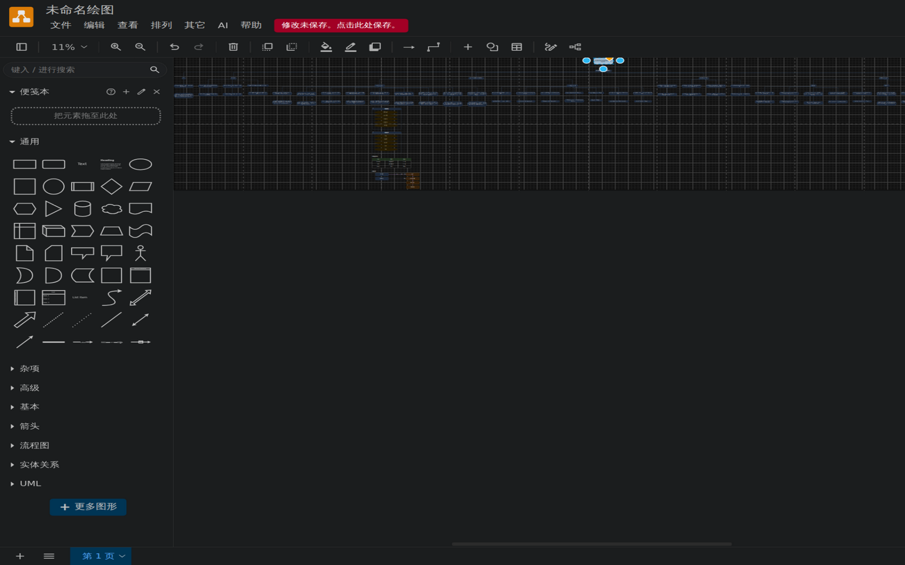
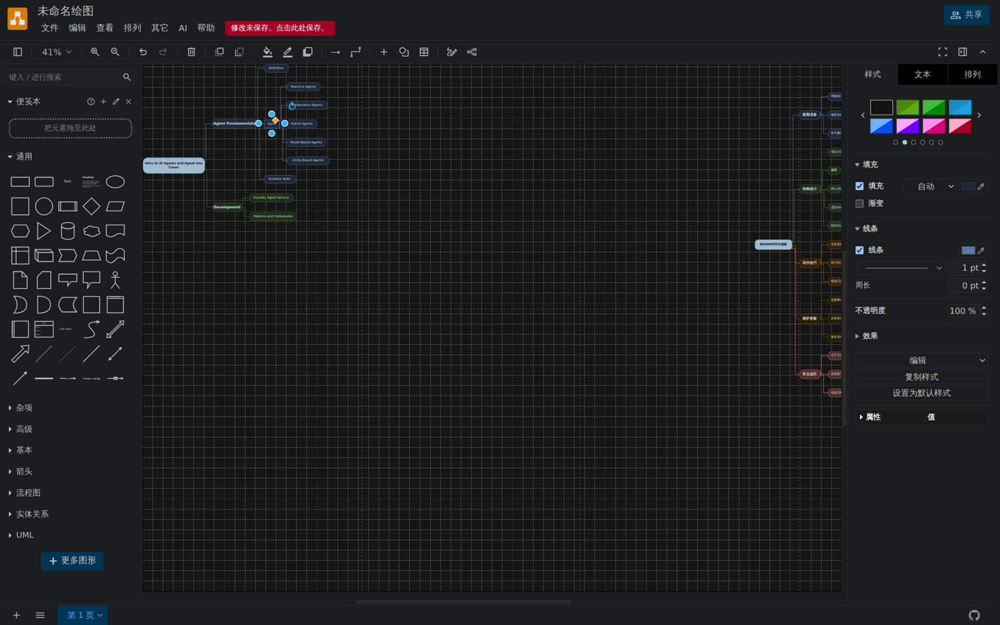
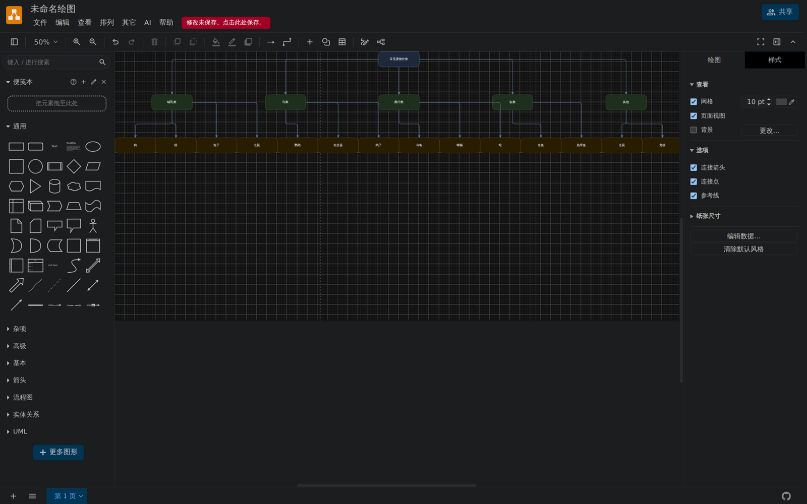
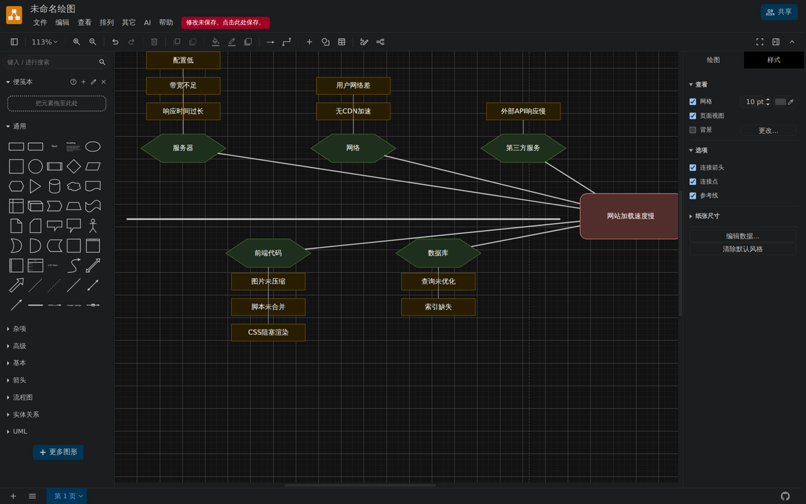

<div align="center">

**简体中文** | [English](README.en.md)

</div>

<p align="center">
  
</p>

<h1 align="center">MindmapAI</h1>

<p align="center">
  <b>AI 思维导图制作器 · 基于 drawio 二次开发</b><br>
  <sub>AI-powered mind mapping &amp; thinking charts — built on drawio</sub>
</p>

<p align="center">
  <a href="LICENSE"></a>&nbsp;
  &nbsp;
  &nbsp;
  <a href="NOTICE.md"></a>
</p>

> 给它一个**主题**、一段**文字**或一个**网页链接**，自动生成结构清晰、可溯源、可继续编辑的思维导图与思考图表。完整保留 drawio 编辑器的全部能力。

MindmapAI 以 drawio 插件的形式注入 AI 生成能力，并以 Electron 打包为独立桌面应用。
本仓库**只包含 MindmapAI 的原创代码**：上游编辑器源码由
`scripts/setup-upstream.mjs` 按固定版本从官方仓库拉取后自动注入接入点
（见 [NOTICE.md](NOTICE.md)），不随本仓库分发。

| | |
|---|---|
|  |  |
|  |  |

## 功能亮点

### AI 生成思维导图

- **三种内容来源**：仅主题 / 粘贴文本 / 网页链接。链接模式支持 GitHub 页面自动转
  raw 直连、B 站视频页元数据解析，抓取失败自动走回退链（直连 → 内置本机中继
  → 自定义/公共抓取代理）。经 `start.sh`/`start.cmd` 启动时本机中继开箱即用；
  其它托管方式可用零依赖的[本地抓取代理](ai/tools/local-fetch-proxy.mjs)。
- **评审管线**：提炼要点 → 架构导图 → 自动评审，四维度评分不达标时自动回炉重构
  一次；生成中可随时取消。
- **Agent 过程面板**：侧边栏实时展示 AI 的真实工作内容——提炼出的每条要点原文
  与引文、结构骨架、评审四维分数与评语、回炉原因、每张图表进度
  （AI → Agent 面板）。
- **Agent 模式（实验性）**：勾选后控制流交给模型——它用真正的工具
  （读要点 / 抓网页 / 逐个放节点 / 自检修正）自主装配整张导图或思考图，
  直到自己宣布完成（工具调用数与节点数硬上限兜底）。
- **对话式修改**：在 Agent 面板输入框直接下指令（如"把术语统一为 AI
  Agent"、"给根节点加一个对比分支"），Agent 用工具改完自动重排上画布。
- **确定性质量校验**：同级重复概念自动合并；跨分支重复与超长平铺列表报告给
  评审环节；prompt 层强制术语一致、同级同维度、长列表分组收敛。
- **AI 自动参数**：层数、每层分支数、节点上限由 AI 按内容密度自动决定，也可手动
  指定（层级 1-6 / 分支 1-10 / 节点上限 5-200）。
- **详细模式**：全部要点逐条成叶，原文引文直接成为画布上的引用节点；大来源还会
  额外生成支线小导图、要点表格与关系图（复合画布）。
- **节点扩展**：右键任一节点，带完整上下文继续向下生成一层，Ctrl+Z 一步撤销。
- **全程溯源**：节点悬停显示原文引文，引文随 `.drawio` 文件持久化保存，重开不丢。

### 12 种思考图表

圆圈图 / 气泡图 / 双重气泡图 / 树形图 / 流程图 / 多重流程图 / 括号图 / 韦恩图 /
鱼骨图 / 时间线 / 桥状图 / 组织结构图——生成对话框一键切换，每种类型带定义与
适用场景说明。

- AI 按语义从 20+ 种 drawio 形状部件（胶囊、菱形、圆柱、泳道、人形、便签，以及
  8 个内联 SVG 语义图标：AI/工具/目标/知识库/群体……）中自主选型，不再只会用矩形。
- 全部图表使用**确定性几何布局**，布局函数有单元测试保证零重叠。
- **「AI 修改此图」**：对已生成的图表追加自然语言修改指令，增量修改后校验重绘。
- **全景画布**：生成对话框选「全部思考图（全景画布）」，同一来源一次生成 12 种
  思考图并排布到同一画布（每图一次 AI 调用，单张失败自动跳过）。

### 布局与编辑体验

- 径向 / 竖向树 / 横向树三种布局，树状/流程/组织图可切换方向；替换或扩展节点后
  自动按边样式识别布局种类并整图重排。
- 单事务构建：Ctrl+Z 一步撤销整张图；AI 生成的内容带样式标记，替换时不会误碰
  手绘内容。
- **逐个放置动画**：生成后节点按装配顺序在画布上一个个"放"出来（纯视觉层
  渐显，不进撤销栈，Ctrl+Z 仍一步撤销整张图）。
- **画布比例**：16:9 / 4:3 / 1:1 / 自动——布局间距按目标比例自适应，
  不再生成一长条。
- 生成选项（含对话框取值、厂商与密钥）自动记忆，下次打开无需重填。

### 多厂商模型接入

内置 12 家厂商预设（选中自动填充端点与默认模型）：DeepSeek、火山方舟（按量 /
Coding Plan）、智谱 GLM、OpenAI、Kimi For Coding、Moonshot、通义千问、MiniMax、
硅基流动、OpenRouter、Ollama（本地）。任何 OpenAI 兼容端点均可手动配置。

联调不花钱：`ai/dev-mock-server.mjs` 提供本地 mock LLM，支持按阶段脚本化返回。

### 两种形态

- **桌面版**（Windows NSIS 安装包 + MSI）：API Key 经 Electron `safeStorage`
  加密落盘；网络请求经主进程通道转发，网页抓取不受浏览器 CORS 限制。
- **浏览器版**：任意静态服务器即可运行，CSP 之外的抓取场景配代理即可。
- 两者都拥有完整 drawio 编辑器能力：全形状库、手绘风格、VSDX/PNG/PDF/SVG
  导入导出、多人格式兼容等。

## 快速上手

### 安装桌面版（Windows）

从 [Releases](../../releases) 下载 `MindmapAI-x.y.z-windows-installer.exe` 或
`.msi`。安装包未做代码签名，SmartScreen 首次运行会提示——选择「仍要运行」即可。

首次使用：顶部菜单 **AI → 设置…**，选择厂商预设并填入 API Key，「测试连接」通过后，
通过 **AI → 生成思维导图…**（或右键空白画布）开始生成。

### 浏览器版开发模式

```bash
# 一键启动（首次运行自动拉取上游并构建，需网络；之后直接启动服务器并打开浏览器）
node scripts/start.mjs
# Windows 下也可直接双击仓库根目录的 start.cmd
```

手动分步执行（与上面等价）：

```bash
# 0. 拉取上游编辑器源码（pinned 版本）并注入接入点、构建插件（首次执行）
node scripts/setup-upstream.mjs

# 1. 起静态服务器（仓库根目录执行）
python3 -m http.server 8000 -d webapp/src/main/webapp

# 2. 打开 http://localhost:8000/
```

### 桌面版开发模式

```bash
node scripts/setup-upstream.mjs          # 已执行过可跳过（脚本幂等）
cd desktop && ELECTRON_MIRROR="https://npmmirror.com/mirrors/electron/" npm install
MM_WEBAPP_DIR=$(pwd)/../webapp/src/main/webapp npm start
```

### 不消耗配额联调

```bash
node ai/dev-mock-server.mjs
# 然后在 AI → 设置… 中把 Base URL 指向 http://127.0.0.1:8787
```

## 架构

```
┌────────────────────────────────────────────────────┐
│  desktop/  Electron 壳（上游 drawio-desktop 精简）    │
│    IPC: safeStorage 密钥存取 · 主进程 fetch 代理      │
├────────────────────────────────────────────────────┤
│  webapp/   drawio 编辑器（上游 drawio 精简）          │
│    └─ js/ai/mindmap-ai.js   ← 插件 bundle（构建产物） │
├────────────────────────────────────────────────────┤
│  ai/       TypeScript 插件源码（esbuild + vitest）   │
│    agent/   三阶段生成管线（提炼→架构→评审）           │
│    charts/  12 种思考图目录/形状/布局/装配            │
│    mindmap/ 树模型/节点尺寸/放射布局                  │
│    ui/      菜单、对话框、右键动作                    │
│    settings/ 配置持久化与密钥存取（浏览器/Electron 双通道）│
└────────────────────────────────────────────────────┘
```

AI 代码全部收敛在 `ai/`（纯 TS，可独立测试），对上游编辑器的全部接入点只有
10 个文件、对 Electron 壳只有 8 个文件（插件加载、标题与品牌、i18n 资源、
IPC 桥、打包配置），全部由 setup 脚本自动注入并带幂等标记——逐项清单见
[NOTICE.md](NOTICE.md)，注入内容源文件在 `patches/`。

## 目录结构

```
.
├── ai/                 # AI 插件 TypeScript 源码与测试（原创代码）
├── patches/            # 注入内容源文件与上游固定版本（pins.json）
│   ├── webapp/         # i18n 追加块、测试夹具
│   └── desktop/        # Electron 注入块、打包配置、CDP 回归脚本
├── scripts/            # setup-upstream.mjs：拉取上游 + 注入 + 构建
├── docs/               # 设计文档、开发日志、验收截图
│   ├── DEVELOPING.md   # 开发环境与常用命令
│   └── DEVLOG.md       # 开发日志（M0-M8 全过程与经验教训）
├── webapp/             # 上游编辑器源码 —— 运行时由 setup 脚本拉取，不入库
├── desktop/            # Electron 壳源码 —— 同上，不入库
├── LICENSE             # 本项目原创代码的许可证（Apache-2.0）
└── NOTICE.md           # 上游拉取源、注入清单与商标声明
```

## 开发

环境要求与常用命令（构建、测试、CDP 回归、Windows 打包）见
[docs/DEVELOPING.md](docs/DEVELOPING.md)；逐里程碑的开发记录与踩坑经验见
[docs/DEVLOG.md](docs/DEVLOG.md)。

```bash
cd ai && npm run typecheck && npm test && npm run build
```

## 路线图

- [x] MVP：主题/文本/链接三来源生成、评审管线、12 种思考图表、桌面版打包
- [x] 原创应用图标与 PWA 品牌（替换上游品牌元素，见 `patches/assets/mindmapai-icon.svg`）
- [ ] 对话式侧边栏、导图优化与总结
- [ ] 文档转导图（Markdown / Word / PDF）、Markdown 双向编辑
- [ ] XMind / Freeplane / OPML 导入
- [ ] macOS / Linux 打包、安装包代码签名

## 许可与致谢

- 本项目以 [Apache-2.0](LICENSE) 发布。
- 运行时拉取的上游源码（jgraph/drawio 与 jgraph/drawio-desktop，均为
  Apache-2.0）不在本仓库分发，其许可证文件随上游克隆保持原样；对本仓库
  不分发、但对上游源码所做的全部注入已在 [NOTICE.md](NOTICE.md) 中逐项声明。
- "draw.io"、"drawio" 是 JGraph AG 的商标；本项目为独立二次开发发行版，
  与 JGraph AG 无关联，亦未获得其背书。
- **非商业声明**：本项目为个人开发者的非营利项目——不以营利为目的运营，
  不售卖本应用或其安装包，不内置广告与收费服务；按「现状」提供，不附带
  任何担保。
- 隐私：应用只把你配置的 LLM 端点和你主动要求抓取的页面作为网络请求目标，
  不内置任何遥测，详见 [NOTICE.md](NOTICE.md) 的隐私说明。
